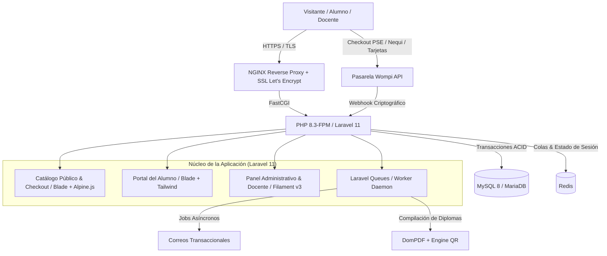
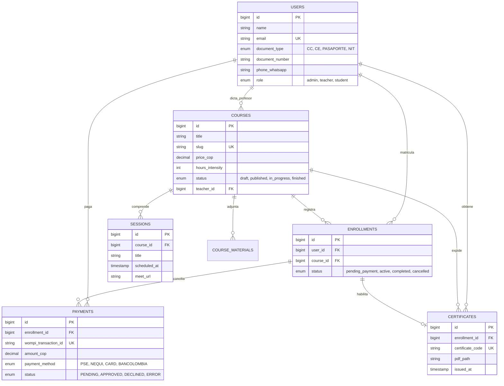

<div align="center">

# 🏛️ SJI Colombia — Plataforma de Cursos Jurídicos en Vivo
### Sistema de Gestión de Aprendizaje (LMS) & Certificación Digital Verificable

[](https://php.net)
[](https://laravel.com)
[](https://filamentphp.com)
[](https://tailwindcss.com)
[](https://mysql.com)
[](https://redis.io)
[](https://wompi.co)

<br />

Plataforma integral de formación continua especializada en derecho inmobiliario y propiedad horizontal para la firma **Soluciones Jurídicas e Inmobiliarias de Colombia S.A.S. (SJI Colombia)**, con sede en Santa Marta.

[Explorar el PRD](docs/PRD_Plataforma_Cursos_SJI_Colombia.md) • [Plan Técnico de Arquitectura](docs/PLAN_TECNICO_IMPLEMENTACION_LMS.md) • [Reportar Bug](https://github.com/cristborrero/sjicolombia-school/issues)

</div>

---

## 📌 Contexto & Propósito del Proyecto

SJI Colombia requería transformar su modelo de capacitación presencial e informal en una **unidad de negocio digital automatizada y escalable**. El reto consistió en diseñar y construir una solución que erradicara la fuga de pagos manuales por WhatsApp, garantizara control estricto sobre las salas de clase en vivo y dotara a la firma de un sistema institucional de **certificación digital con validación pública por código QR**.

### Logros Clave de Ingeniería y Producto
- **Flujo de Pago 100% Autónomo:** Integración con la pasarela colombiana **Wompi** (PSE, Nequi, tarjetas y Bancolombia) con validación criptográfica de firmas SHA-256 en webhooks para acreditación instantánea de matrículas.
- **Aislamiento en Servidor Virtual Privado (VPS):** Infraestructura dedicada (Ubuntu 24.04 + NGINX + PHP-FPM) para asegurar rendimiento y salvaguardar el sitio corporativo principal.
- **Procesamiento Asíncrono:** Empleo de colas con Redis y Supervisor para la generación de diplomas en PDF y despacho de correos transaccionales sin degradar la experiencia de usuario.
- **Certificados Verificables en Tiempo Real:** Generación de diplomas en alta fidelidad con código alfanumérico y código QR que valida públicamente la autenticidad del documento emitido por la firma.

---

## 🏗️ Arquitectura de Software

La plataforma adopta una arquitectura monolítica modular moderna (**TALL Stack**), priorizando simplicidad operativa, alta cohesión y bajo consumo de memoria:



---

## 🧩 Módulos Principales del Sistema

### 1. Catálogo de Cursos & Experiencia de Inscripción
- Fichas académicas detalladas con intensidad horaria, perfil de ingreso, requisitos y temario estructurado.
- Formulario de matrícula adaptado a la legislación colombiana (Tipo y número de identificación, WhatsApp, ciudad).
- Botón flotante persistente de atención y soporte vía WhatsApp para maximizar la tasa de conversión.

### 2. Panel Administrativo & Docente (Filament v3)
- Gestión centralizada de programas, cohortes y precios.
- Creación y calendarización de sesiones en vivo con enlace seguro de Zoom / Google Meet.
- Matriz de inscritos con filtro de asistencia para control en sala de espera.
- Repositorio de lecturas y presentaciones descargables por clase.

### 3. Portal Privado del Alumno
- Acceso exclusivo al cronograma del curso y enlaces activos de streaming condicionados al estado del pago.
- Descarga organizada de material de apoyo pedagógico.
- Visualización y descarga inmediata del certificado oficial de finalización.

### 4. Motor de Certificación & Validación Pública
- Emisión automatizada de diplomas en PDF en orientación apaisada.
- Asignación de identificador criptográfico único (ej. `SJI-2026-X89K2`).
- Código QR interactivo embebido que redirige a `https://cursos.sjicolombia.com/verificar/[CODIGO]`.
- Módulo público de consulta para validación por parte de terceros y juntas de copropietarios.

---

## 🗄️ Modelo Relacional de Datos



---

## 🛠️ Entorno Local & Puesta en Marcha

### Prerrequisitos
- **PHP** >= 8.3 (extensiones: `pdo_mysql`, `mbstring`, `openssl`, `gd`, `bcmath`, `redis`)
- **Composer** >= 2.7
- **Node.js** >= 20.x & **NPM**
- **MySQL** 8.0 o **MariaDB** 10.11
- **Redis** Server

### Instalación Paso a Paso

```bash
# 1. Clonar el repositorio
git clone https://github.com/cristborrero/sjicolombia-school.git
cd sjicolombia-school

# 2. Instalar dependencias de PHP
composer install

# 3. Instalar y compilar assets de frontend
npm install
npm run build

# 4. Configurar variables de entorno
cp .env.example .env
php artisan key:generate

# 5. Ejecutar migraciones y datos de prueba
php artisan migrate --seed

# 6. Levantar servidor local y worker de colas
php artisan serve
php artisan queue:work
```

---

## 📋 Variables de Entorno Críticas (.env)

```env
APP_NAME="SJI Escuela Jurídica"
APP_URL=http://localhost:8000

# Base de Datos
DB_CONNECTION=mysql
DB_HOST=127.0.0.1
DB_PORT=3306
DB_DATABASE=sji_school
DB_USERNAME=root
DB_PASSWORD=secret

# Colas y Caché
QUEUE_CONNECTION=redis
REDIS_HOST=127.0.0.1
REDIS_PORT=6379

# Pasarela Wompi Colombia
WOMPI_PUBLIC_KEY=pub_test_xxxxxx
WOMPI_PRIVATE_KEY=prv_test_xxxxxx
WOMPI_EVENTS_SECRET=events_secret_xxxxxx
WOMPI_INTEGRITY_SECRET=integrity_secret_xxxxxx
```

---

## 📅 Hoja de Ruta de Ingeniería

- [x] **Fase 0 — Análisis & Especificación:** PRD v1.1 y arquitectura de sistemas aprobada.
- [ ] **Sprint 1 — Cimientos:** Aprovisionamiento de VPS, configuración de Laravel 11, Filament v3 y esquema relacional.
- [ ] **Sprint 2 — E-Commerce & Checkout:** Catálogo optimizado, registro localizado y webhook de Wompi.
- [ ] **Sprint 3 — Experiencia Docente & Alumno:** Aula virtual, control de asistencia y entrega de contenidos.
- [ ] **Sprint 4 — Certificación & Go-Live:** Generador de diplomas PDF con QR, auditoría de seguridad y despliegue.

---

## 👨‍💻 Autor y Créditos

Proyecto conceptualizado, diseñado y desarrollado por:

**Cristian Ted Borrero Reina**  
*Senior Software Architect & Full-Stack Engineer*  
Founder & Technical Lead en **LevelOne Agency**  
- **LinkedIn:** [cristianborrero](https://linkedin.com/in/cristianborrero)  
- **GitHub:** [@cristborrero](https://github.com/cristborrero)  

---

<div align="center">
  <sub>Desarrollado para <b>Soluciones Jurídicas e Inmobiliarias de Colombia S.A.S. (SJI Colombia)</b>. Todos los derechos reservados © 2026.</sub>
</div>
