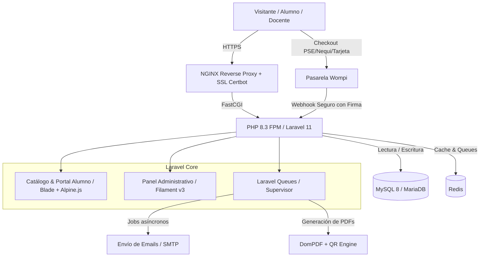
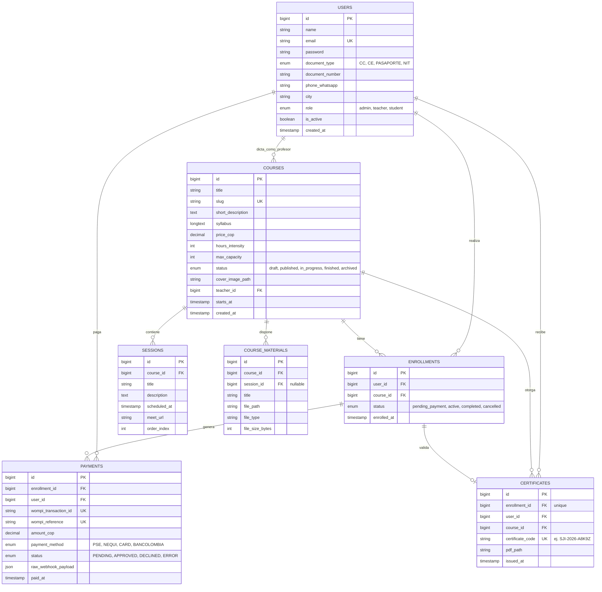

# Plan Técnico de Implementación — LMS Cursos Jurídicos en Vivo (SJI Colombia)

Documento de arquitectura técnica, modelo de datos y plan de ejecución sprint a sprint para la plataforma educativa de **SJI Colombia (Soluciones Jurídicas e Inmobiliarias de Colombia S.A.S.)**.

---

## 1. Resumen de Arquitectura y Stack Tecnológico

La plataforma se concibe como una aplicación web monolítica modular moderna, optimizada para rendimiento, bajo consumo de recursos en VPS y rapidez de salida al mercado.

### Componentes Clave:
- **Framework Base:** PHP 8.3 + Laravel 11 LTS.
- **Panel Administrativo & Gestión Interna:** Filament PHP v3 (TALL stack: Tailwind, Alpine.js, Laravel, Livewire).
- **Frontend Público & Panel de Alumno:** Blade components + Tailwind CSS + Alpine.js (ligero, veloz, sin sobrecarga de hidratación SPA).
- **Base de Datos:** MySQL 8.0 o MariaDB 10.11 con soporte para transacciones ACID.
- **Colas & Tareas Asíncronas:** Redis + Laravel Queue gestionado por Supervisor (para envío de correos y generación de certificados PDF sin congelar la UI).
- **Infraestructura:** VPS Linux Ubuntu 24.04 LTS (Hostinger KVM 2 o Hetzner Cloud).

---

## 2. Modelo de Base de Datos Relacional (Schema)

---

## 3. Especificación de Integraciones Críticas

### 3.1 Pasarela de Pagos (Wompi Colombia)
1. **Iniciación:** En el checkout, se genera una referencia única (`SJI-{enrollment_id}-{timestamp}`) y se calcula la firma de integridad SHA-256 usando el secreto provisto por Wompi.
2. **Widget Checkout:** Se invoca el widget oficial de Wompi permitiendo pagar mediante PSE, Nequi, Tarjetas de Crédito o Botón Bancolombia.
3. **Webhook Handler (`/api/webhooks/wompi`):**
   - Validación obligatoria de la firma del evento con el `events_secret`.
   - Búsqueda de la orden por `reference`.
   - Transición idempotente: si el evento es `APPROVED` y la matrícula está `pending_payment`, se marca `active` y se despacha el job de correo de bienvenida y acceso al aula.

### 3.2 Generación y Verificación de Certificados
1. **Emisión:** Se activa cuando el curso finaliza o el alumno cumple asistencia mínima.
2. **Generación:**
   - Creación de código criptográfico alfanumérico único (ej. `SJI-2026-F98BC`).
   - Inyección de QR con URL pública `https://cursos.sjicolombia.com/verificar/SJI-2026-F98BC`.
   - Renderizado con DomPDF en tamaño A4 apaisado con diseño institucional de SJI.
3. **Página de Verificación Pública (`/verificar/{code}`):**
   - No requiere login.
   - Muestra de forma pública: Nombre del estudiante, documento anonimizado (`CC ***.***.892`), nombre del curso, intensidad horaria, fecha de expedición y sello digital de autenticidad de SJI Colombia.

---

## 4. Plan de Ejecución Sprint por Sprint (6 Semanas)

### Sprint 1: Setup de Infraestructura, Base de Datos y Panel Admin (Semana 1)
- [ ] Configuración del VPS en Ubuntu 24.04 con NGINX, PHP 8.3, MySQL y Redis.
- [ ] Creación de subdominio `cursos.sjicolombia.com` y certificado SSL con Let's Encrypt.
- [ ] Instalación de Laravel 11 y configuración del entorno `.env`.
- [ ] Creación de migraciones, modelos y relaciones Eloquent según el schema.
- [ ] Instalación de **Filament PHP v3** y generación de Resources:
  - CRUD de Cursos (con gestión de fechas, temarios y precio).
  - CRUD de Sesiones en vivo.
  - CRUD de Usuarios con asignación de roles.
  - Gestión de Materiales adjuntos.

### Sprint 2: Catálogo Público, Registro y Checkout Wompi (Semana 2)
- [ ] Maquetación del Catálogo de Cursos inspirado en los estándares de educación continua (Politécnico):
  - Ficha de curso con temario, horas, modalidad y perfil de ingreso.
  - Botón persistente flotante de WhatsApp para soporte y ventas.
- [ ] Formulario de Registro rápido con campos colombianos (Tipo y número de cédula, celular, ciudad).
- [ ] Creación del flujo de Checkout: cálculo de firma Wompi y apertura del widget.
- [ ] Controlador de Webhook de Wompi con validación de firma y confirmación automática de matrícula.
- [ ] Pruebas completas en entorno Sandbox de Wompi con pagos simulados de PSE y Nequi.

### Sprint 3: Aula Virtual, Panel del Alumno y del Docente (Semanas 3–4)
- [ ] **Portal del Alumno:**
  - Vista "Mis Cursos Inscritos".
  - Pantalla del aula con cronograma de sesiones.
  - Botón dinámico de acceso a la clase en vivo de Zoom/Google Meet (solo visible para inscritos confirmados).
  - Descarga de archivos y lecturas de apoyo subidas por el profesor.
- [ ] **Portal del Docente / Panel de Control de Sala:**
  - Vista de próximas clases.
  - Listado de alumnos matriculados con documento de identidad para verificación en sala de espera.
  - Subida directa de materiales y presentaciones PDF.
- [ ] Configuración del servicio de correo transaccional (Resend o Amazon SES) para avisos de compra y recordatorios de clase.

### Sprint 4: Módulo de Certificación, Pruebas y Despliegue (Semanas 5–6)
- [ ] Diseño de la plantilla Blade para el certificado oficial de SJI Colombia.
- [ ] Implementación del generador de QR y compilación de PDF en segundo plano (Laravel Queues).
- [ ] Creación de la ruta pública de verificación de certificados `/verificar/{codigo}`.
- [ ] Configuración de Supervisor en el VPS para asegurar que los workers de colas permanezcan siempre activos.
- [ ] Pruebas de estrés y seguridad (Habeas Data, protección de rutas y permisos).
- [ ] Pase de credenciales de Wompi de Sandbox a Producción y prueba de compra real de $1.000 COP.
- [ ] Entrega formal y capacitación básica al equipo de SJI para la creación de su primer curso.

---

## 5. Plan de Verificación y Testing

### Pruebas Automatizadas (Pest / PHPUnit)
- `tests/Feature/WompiWebhookTest.php`: Verifica que un webhook legítimo aprueba la matrícula y que un webhook con firma alterada es rechazado con error 400/401.
- `tests/Feature/CourseEnrollmentTest.php`: Verifica que un usuario no autenticado o no pagado no pueda acceder a los enlaces de videollamada ni a los materiales protegidos.
- `tests/Unit/CertificateCodeGeneratorTest.php`: Verifica unicidad y formato del código alfanumérico de certificación.

### Pruebas Manuales y de Aceptación
1. **Flujo de Venta Completo:** Registrar un usuario nuevo, pagar vía Sandbox Wompi simulando PSE Nequi, verificar activación inmediata en base de datos y recepción de correo de bienvenida.
2. **Validación de Diploma:** Generar un certificado de prueba, escanear el QR desde un teléfono móvil físico y constatar que abre la página de validación institucional de SJI con los datos correctos.
